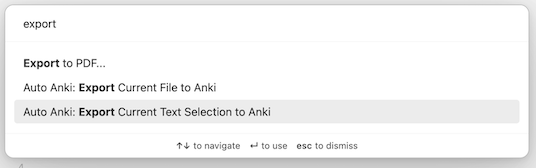
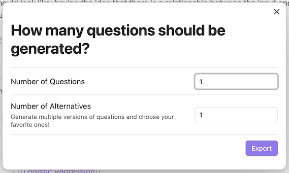

# Obsidian Auto Anki

Plugin for [Obsidian.md](https://obsidian.md/) that uses OpenAI's GPT LLM to automatically generate Flashcards for Anki.

> The plugin **only works for desktop** (tested on a Mac M1).

The plugin introduces two new commands into obsidian:
- _Export Current File to Anki_
- _Export Highlighted Text to Anki_
These commands will **not** be avaialable if you do not have an active `Editable` window open (i.e. you need to have a document open, and it needs to be in `edit` mode).

The command palette can be accessed on Obsidian through the following hotkey (default): `CMD` + `P`

.

If desired, you can set your own hotkeys for the new commands.

The two new commands look like the following:

### Plugin Requirements

The following are required for the Plugin to work:
- An [OpenAI](https://openai.com/) Account and an [OpenAI API Key](https://platform.openai.com/account/api-keys)
- The [Anki](https://apps.ankiweb.net/) program, installed locally
- [Anki Connect](https://github.com/FooSoft/anki-connect), to expose an Anki API for Obsidian to make calls to

### Plugin Setup

1. Download and install the plugin (Options > Community Plugins)
2. Ensure that you have all the requirements in the [Plugin Requirements](#plugin-requirements)
3. Go to the Plugin Settings (Settings > Community Plugins > Auto Anki) and make sure to set the following fields appropriately:
  - Anki Port (by default, this is `8765`)
  - Anki Deck Name (by default, this is `Default`)
  - OpenAI API Key
4. Enjoy!

### Feature Details

- Exporting an Entire File to Anki (Command: _Export Current File to Anki_)
This command allows you to use the contents of the currently-opened file to sends to GPT and generate a list of questions and answers.

Alternatively, you can also specify the _number of alternatives_ to generate for each question. This allows you more variety in the "questions and answers" generated by GPT, as it allows you to choose among a larger number of alternative "questions and answers"

From the generated list of "questions and answers", you have the option to pick and choose the ones you want.

After picking and choosing, your selected "questions and answers" automatically imports the chosen questions to Anki, based on the details in your Plugin settings. (Important Note: file needs to be in `edit` mode for the command to be available).

> It may take a while if you are generating a large number of questions, or a large number of alternatives. Future plan is to improve the UI interactions to make this more obvious and seamless.

- Exporting Highlighted Text to Anki (Command: _Export Highlighted Text to Anki_)
This command is similar to "Exporting an Entire File to Anki", but this allows you to use the currently-highlighted text (instead of the whole file) to send to GPT and generate a list of questions and questions. (Important Note: file also needs to be in `edit` mode for the command to be available).

### Motivation

With the kajillion things I read and watch on a daily basis, I've recently found myself struggling to retain knowledge of the things I've consumed. Hence, I've found myself trying to find new ways to enhance my self-education. I came upon [Spaced Repetition](https://en.wikipedia.org/wiki/Spaced_repetition), and wanted to try to use [Anki](https://apps.ankiweb.net/) to supplement my daily learnings. Being a long-time user and lover of [Obsidian.md](https://obsidian.md/) as my PKM (Personal Knowledge Management), I wanted to see if there was a way to automate my learning using spaced repetition with my current Obsidian vaults.

I looked at other [similar plugins](https://github.com/Pseudonium/Obsidian_to_Anki) that attempt to connect Obsidian to Anki, but a lot of require you to change how you write your notes in Obsidian, or just don't seem automated enough. What this plugin does is automate the creation of ["flashcard-style" questions and answers](https://en.wikipedia.org/wiki/Leitner_system) but without needing to format your notes for this purpose.

I consider myself a complete beginner when it comes to Spaced Repetition, Anki, or the general world of learning techniques, so I am always very open to suggestions, discussions, or any comments about the topic!

## Issues, Discussion, etc

I keep track of all things related to this plugin mostly in [issues](https://github.com/ad2969/obsidian-auto-anki/issues). Feel free to report bugs and/or requests there!
